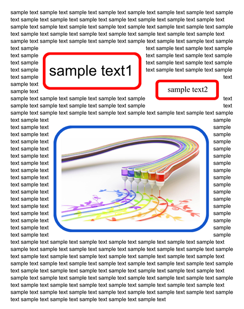

# PDFApp

<a name="top"></a>
[MIT License](LICENCE)

<a name="overview"></a>

# Overview

This is a Google Apps Script library for managing PDFs.


<a name="description"></a>

# Description

Google Apps Script is one of the most powerful tools for cloud computing. When Google Apps Script is used, the result can be obtained even when the user doesn't stay in front of the PC and mobile phone by the triggers. One day, there might be a case where it is required to manage PDF data using Google Apps Script. The combination of Google Docs (Document, Spreadsheet, and Slide) and PDFs is useful for various situations. However, unfortunately, there are no built-in methods for directly managing PDFs using Google Apps Script. Fortunately, it seems that [pdf-lib](https://pdf-lib.js.org/) of the Javascript library can be used with Google Apps Script. By this, PDF data can be managed with Google Apps Script using this library. This Google Apps Script library manages PDFs by using it as a wrapper between Google Apps Script and pdf-lib.

I have already published the following posts.

- [Exporting Specific Pages From a PDF as a New PDF Using Google Apps Script](https://medium.com/google-cloud/exporting-specific-pages-from-a-pdf-as-a-new-pdf-using-google-apps-script-2f22d07b4618)
- [Management of PDF Metadata using Google Apps Script](https://medium.com/google-cloud/management-of-pdf-metadata-using-google-apps-script-60fd41f4fc16)
- [Changing Order of Pages in PDF file using Google Apps Script](https://medium.com/google-cloud/changing-order-of-pages-in-pdf-file-using-google-apps-script-f6b3de05d7df)
- [Merging Multiple PDF Files as a Single PDF File using Google Apps Script](https://tanaikech.github.io/2023/01/10/merging-multiple-pdf-files-as-a-single-pdf-file-using-google-apps-script/)
- [Converting All Pages in PDF File to PNG Images using Google Apps Script](https://tanaikech.github.io/2023/01/11/converting-all-pages-in-pdf-file-to-png-images-using-google-apps-script/)
- [Retrieving and Putting Values for PDF Forms using Google Apps Script](https://medium.com/google-cloud/retrieving-and-putting-values-for-pdf-forms-using-google-apps-script-92412a7cf0af)
- [Creating PDF Forms from Google Slide Template using Google Apps Script](https://medium.com/google-cloud/creating-pdf-forms-from-google-slide-template-using-google-apps-script-cef35e7d9822)
- [Embedding Objects in PDF using Google Apps Script](https://medium.com/google-cloud/embedding-objects-in-pdf-using-google-apps-script-ddbee857c642)

I created this library to more efficiently manage PDFs with a simple script by summarising the scripts of these posts.

# Library's project key

```
1Xmtr5XXEakVql7N6FqwdCNdpdijsJOxgqH173JSB0UOwdb0GJYJbnJLk
```

<a name="usage"></a>

# Usage

## 1. Install library

In order to use this library, please install the library as follows.

1. Create a GAS project.

   - You can use this library for the GAS project of both the standalone and container-bound script types.

1. [Install this library](https://developers.google.com/apps-script/guides/libraries).

   - Library's project key is **`1Xmtr5XXEakVql7N6FqwdCNdpdijsJOxgqH173JSB0UOwdb0GJYJbnJLk`**.

# Scopes

This library uses the following 3 scopes.

- `https://www.googleapis.com/auth/script.external_request`
- `https://www.googleapis.com/auth/drive`
- `https://www.googleapis.com/auth/presentations`


# Methods

| Methods                                                 | Description                                                                                                                                                                                                                                                                                                           |
| :-------- | :------------------ |
| [setPDFBlob](#setpdfblob) | Give the source PDF blob. This method is used with other methods. |
| [useStandardFont](#usestandardfont) | When you want to use the standard font, please use this method. This method is used with other methods. |
| [useCustomFont](#usecustomfont) | When you want to use the custom font, please use this method. This method is used with other methods. |
|||
| [exportPages](#exportpages) | Export specific pages from a PDF blob. |
| [getMetadata](#getmetadata) | Get PDF metadata from a PDF blob. |
| [udpateMetadata](#udpatemetadata) | Update PDF metadata of a PDF blob. |
| [reorderPages](#reorderpages) | Reorder pages of a PDF blob. |
| [mergePDFs](#mergepdfs) | Merge multiple PDF files in a single PDF. |
| [convertPDFToPng](#convertpdftopng) | Convert PDF pages to PNG images. |
| [getValuesFromPDFForm](#getvaluesfrompdfform) | Get values from PDF Form. |
| [setValuesToPDFForm](#setvaluestopdfform) | Set values to PDF Form. |
| [createPDFFormBySlideTemplate](#createpdfformbyslidetemplate) | Create PDF Form By Google Slide template. |
| [embedObjects](#embedobjects) | Embed objects into PDF blob. |


<a name="setpdfblob"></a>

## setPDFBlob

Give the source PDF blob. This method is used with other methods.

In this sample script, the PDF metadata is retrieved.

```javascript
const blob = DriveApp.getFileById("###fileId of PDF file###").getBlob();

PDFApp.setPDFBlob(blob).getMetadata()
  .then(res => console.log(res))
  .catch(err => console.log(err));
```

<a name="usestandardfont"></a>

## useStandardFont

When you want to use the standard font, please use this method. This method is used with other methods.

In this sample script, a value is put into a field of PDF Form with "TimesRoman".

```javascript
const blob = DriveApp.getFileById("###fileId of PDF file###").getBlob();
const object = {
  values: [
    { "name": "textbox.sample1.sample1.page1", "value": "sample update text" }
  ],
};

PDFApp
.setPDFBlob(blob)
.useStandardFont("TimesRoman")
.setValuesToPDFForm(object)
  .then(newBlob => folder.createFile(newBlob))
  .catch(err => console.log(err));
```

<a name="usecustomfont"></a>

## useCustomFont

When you want to use the custom font, please use this method. This method is used with other methods.

In this sample script, a value is put into a field of PDF Form with a custom font.

```javascript
const blob = DriveApp.getFileById("###fileId of PDF file###").getBlob();
const object = {
  values: [
    { "name": "textbox.sample1.sample1.page1", "value": "sample update text" }
  ],
};

PDFApp
.setPDFBlob(blob)
.useCustomFont(DriveApp.getFileById("###fileId of font file###).getBlob())
.setValuesToPDFForm(object)
  .then(newBlob => folder.createFile(newBlob))
  .catch(err => console.log(err));
```

<a name="exportpages"></a>

## exportPages


Export specific pages from a PDF blob.

```javascript
const blob = DriveApp.getFileById("###fileId of PDF file###").getBlob();
const pageNumbers = [2, 4, 6, 8];

PDFApp.setPDFBlob(blob).exportPages(pageNumbers)
  .then(blob => DriveApp.createFile(blob))
  .catch(err => console.log(err));
```

- In this sample, 2, 4, 6, 8, pages are exported. And, a new PDF file is created to the root folder.
- This is from my post "[Exporting Specific Pages From a PDF as a New PDF Using Google Apps Script](https://medium.com/google-cloud/exporting-specific-pages-from-a-pdf-as-a-new-pdf-using-google-apps-script-2f22d07b4618)".

<a name="getmetadata"></a>

## getMetadata


Get PDF metadata from a PDF blob.

```javascript
const blob = DriveApp.getFileById("###fileId of PDF file###").getBlob();

PDFApp.setPDFBlob(blob).getMetadata()
  .then(res => console.log(res))
  .catch(err => console.log(err));
```

- When this script is run, the metadata is retrieved from the inputted PDF blob.

- When I tested this script, I noticed that the values of `modificationDate` and `producer` might be a bug in pdf-lib. `modificationDate` returns the execution time. `producer` always returns pdf-lib (https://github.com/Hopding/pdf-lib). I guessed that this might be a bug in pdf-lib. And, I would like to believe that this will be resolved in the future update.

- This is from my post "[Management of PDF Metadata using Google Apps Script](https://medium.com/google-cloud/management-of-pdf-metadata-using-google-apps-script-60fd41f4fc16)".

<a name="udpatemetadata"></a>

## udpateMetadata


Update PDF metadata of a PDF blob.

```javascript
const blob = DriveApp.getFileById("###fileId of PDF file###").getBlob();

const object = {
  title: ["sample title", { showInWindowTitleBar: true }], // This property is an array.
  subject: "sample subject",
  author: "sample author",
  creator: "sample creator",
  creationDate: new Date("2023-08-01T00:00:00"), // This value is date object.
  modificationDate: new Date("2023-08-01T10:00:00"), // This value is date object.
  keywords: ["sample keyword 1", "sample keyword 2", "sample keyword 3"], // This property is an array.
  producer: "sample producer",
};

PDFApp.setPDFBlob(blob).udpateMetadata(object)
  .then(newBlob => DriveApp.createFile(newBlob))
  .catch(err => console.log(err));
```

- When this script is run, the metadata of "title", "subject", "author", "creator", "creationDate", "modificationDate", "keywords", and "producer" is updated. And, after the update is finished, a new PDF file is created in the root folder.

- This is from my post "[Management of PDF Metadata using Google Apps Script](https://medium.com/google-cloud/management-of-pdf-metadata-using-google-apps-script-60fd41f4fc16)".

- The detailed information of each property in the object can be seen at [https://pdf-lib.js.org/docs/api/classes/pdfdocument](https://pdf-lib.js.org/docs/api/classes/pdfdocument).

<a name="reorderpages"></a>

## reorderPages


Reorder pages of a PDF blob.

```javascript
const blob = DriveApp.getFileById("###fileId of PDF file###").getBlob();

const newOrderOfpages = [3, 1, 2, 5, 4]; // Please set new order of the pages in a PDF file. In this sample, the order of pages of the original PDF file is changed to 3, 1, 2, 5, 4.

const ignoreSkippedPages = true; // If this is false, when the PDF has 5 pages and "newOrderOfpages" is "[3, 2]", the exported PDF file has 5 pages of 3, 2, 1, 4, 5. If this is true, when the PDF has 5 pages and "newOrderOfpages" is "[3, 2]", the exported PDF file has only 2 pages of 3 and 2.

PDFApp.setPDFBlob(blob).reorderPages({ newOrderOfpages, ignoreSkippedPages })
  .then(newBlob => DriveApp.createFile(newBlob))
  .catch(err => console.log(err));
```

- When this script is run, a new PDF file is created with the new order of pages.

- When the order of pages is changed, I thought that for example, when a PDF file has 5 pages and you want to replace only the 1st page and the 2nd page, the actual exported pages are 2, 1, 3, 4, 5. But, in this script, when `ignoreSkippedPages` is used as false, this can be achieved by `newOrderOfpages` of `[2, 1]`. On the other hand, when `ignoreSkippedPages` and `newOrderOfpages` are `true` and `[2, 1]`, respectively, a new PDF file with only 2 pages of the 2nd page and the 1st page is created.

- This is from my post "[Changing Order of Pages in PDF file using Google Apps Script](https://medium.com/google-cloud/changing-order-of-pages-in-pdf-file-using-google-apps-script-f6b3de05d7df)".

<a name="mergepdfs"></a>

## mergePDFs


Merge multiple PDF files in a single PDF.

```javascript
const blob1 = DriveApp.getFileById("###fileId of PDF file 1###").getBlob();
const blob2 = DriveApp.getFileById("###fileId of PDF file 2###").getBlob();
const pdfBlobs = [blob1, blob2];

PDFApp.mergePDFs(pdfBlobs)
  .then(newBlob => DriveApp.createFile(newBlob))
  .catch(err => console.log(err));
```

- When this script is run, the PDF of `blob1` and `blob2` are merged in order.

- For example, if you want to merge 5 PDF files, please use `const pdfBlobs = [blob1, blob2, blob3, blob4, blob5]`.

- This is from my post "[Merging Multiple PDF Files as a Single PDF File using Google Apps Script](https://tanaikech.github.io/2023/01/10/merging-multiple-pdf-files-as-a-single-pdf-file-using-google-apps-script/)".

<a name="convertpdftopng"></a>

## convertPDFToPng


Convert PDF pages to PNG images.

```javascript
const blob = DriveApp.getFileById("###fileId of PDF file###").getBlob();

PDFApp.setPDFBlob(blob).convertPDFToPng()
  .then(imageBlobs => imageBlobs.forEach(b => DriveApp.createFile(b)))
  .catch(err => console.log(err));
```

- When this script is run, all pages of the PDF of `blob` are converted to PNG images, and those images are saved as the image files in the root folder.

- This is from my post "[Converting All Pages in PDF File to PNG Images using Google Apps Script](https://tanaikech.github.io/2023/01/11/converting-all-pages-in-pdf-file-to-png-images-using-google-apps-script/)".

- When the number of pages is large, it might be better when the PDF is split by "exportPages" method.

<a name="getvaluesfrompdfform"></a>

## getValuesFromPDFForm


Get values from PDF Form.

```javascript
const blob = DriveApp.getFileById("###fileId of PDF file###").getBlob();

PDFApp.setPDFBlob(blob).getValuesFromPDFForm()
  .then(res => console.log(res))
  .catch(err => console.log(err));
```

- When this script is run, the values are retrieved from all fields of PDF form in the inputted PDF blob.

- This is from my post "[Retrieving and Putting Values for PDF Forms using Google Apps Script](https://medium.com/google-cloud/retrieving-and-putting-values-for-pdf-forms-using-google-apps-script-92412a7cf0af)".

### Limitations

In the current stage, the fields of the textbox, the checkbox, the dropdown list, and the radio button of the PDF Form can be used.

<a name="setvaluestopdfform"></a>

## setValuesToPDFForm


Set values to PDF Form.

### Limitations

In the current stage, the fields of the textbox, the checkbox, the dropdown list, and the radio button of the PDF Form can be used.

### Sample 1

In this sample, the default font is used.

```javascript
const blob = DriveApp.getFileById("###fileId of PDF file###").getBlob();

const object = {
  values: [
    { "name": "textbox.sample1.sample1.page1", "value": "sample update text" },
    { "name": "dropdownlist.sample2.sample1.page1", "value": "sample option5" },
    { "name": "checkbox.sample3.checkbox1.page1", "value": true },
    { "name": "checkbox.sample3.checkbox2.page1", "value": false },
    { "name": "checkbox.sample3.checkbox3.page1", "value": true },
    { "name": "radiobutton.sample4.page1", "value": "radiobutton.sample4.radiobutton2.page1" }
  ],
};

const PDFA = PDFApp.setPDFBlob(blob);
PDFA.setValuesToPDFForm(object)
  .then(newBlob => DriveApp.createFile(newBlob))
  .catch(err => console.log(err));
```

- When this script is run, the values of `object` are put into each field of PDF form and a new PDF blob is returned.

- About the names of each field of PDF form, they can be retrieved by "getValuesFromPDFForm" method.

- This is from my post "[Retrieving and Putting Values for PDF Forms using Google Apps Script](https://medium.com/google-cloud/retrieving-and-putting-values-for-pdf-forms-using-google-apps-script-92412a7cf0af)".

- The detailed information about the format of `name` and each properties can be seen in [this post](https://medium.com/google-cloud/retrieving-and-putting-values-for-pdf-forms-using-google-apps-script-92412a7cf0af).

### Sample 2

In this sample, the standard font is used.

```javascript
const blob = DriveApp.getFileById("###fileId of PDF file###").getBlob();

const object = {
  values: [
    { "name": "textbox.sample1.sample1.page1", "value": "sample update text" },
    { "name": "dropdownlist.sample2.sample1.page1", "value": "sample option5" },
    { "name": "checkbox.sample3.checkbox1.page1", "value": true },
    { "name": "checkbox.sample3.checkbox2.page1", "value": false },
    { "name": "checkbox.sample3.checkbox3.page1", "value": true },
    { "name": "radiobutton.sample4.page1", "value": "radiobutton.sample4.radiobutton2.page1" }
  ],
};

const PDFA = PDFApp.setPDFBlob(blob).useStandardFont("TimesRoman");
PDFA.setValuesToPDFForm(object)
  .then(newBlob => DriveApp.createFile(newBlob))
  .catch(err => console.log(err));
```

- When this script is run, the values of `object` are put into each field of PDF form and a new PDF blob is returned. At that time, "TimesRoman" is used from the standard font.

- The font names of the standard font can be obtained from [https://pdf-lib.js.org/docs/api/enums/standardfonts](https://pdf-lib.js.org/docs/api/enums/standardfonts).

- The detailed information about the format of `name` and each properties can be seen in [this post](https://medium.com/google-cloud/retrieving-and-putting-values-for-pdf-forms-using-google-apps-script-92412a7cf0af).

### Sample 3

In this sample, the custom font is used.

```javascript
const blob = DriveApp.getFileById("###fileId of PDF file###").getBlob();

const object = {
  values: [
    { "name": "textbox.sample1.sample1.page1", "value": "サンプルテキスト1" },
    { "name": "dropdownlist.sample2.sample1.page1", "value": "sample option5" },
    { "name": "checkbox.sample3.checkbox1.page1", "value": true },
    { "name": "checkbox.sample3.checkbox2.page1", "value": false },
    { "name": "checkbox.sample3.checkbox3.page1", "value": true },
    { "name": "radiobutton.sample4.page1", "value": "radiobutton.sample4.radiobutton2.page1" }
  ],
};

const PDFA = PDFApp.setPDFBlob(blob).useCustomFont(DriveApp.getFileById("###fileId of font file###").getBlob());
PDFA.setValuesToPDFForm(object)
  .then(newBlob => DriveApp.createFile(newBlob))
  .catch(err => console.log(err));
```

- When this script is run, the values of `object` are put into each field of PDF form and a new PDF blob is returned. At that time, the custom font is used. For example, when you want to put Japanese language, the custom font is required to be used.

- About the custom font, TTF and OTF files can be used.

- The detailed information about the format of `name` and each properties can be seen in [this post](https://medium.com/google-cloud/retrieving-and-putting-values-for-pdf-forms-using-google-apps-script-92412a7cf0af).

<a name="createpdfformbyslidetemplate"></a>

## createPDFFormBySlideTemplate


Create PDF Form By Google Slide template.

About `methods` property in the object, the method name can be confirmed at the official document. [Ref](https://pdf-lib.js.org/docs/api/)

- Textbox: [https://pdf-lib.js.org/docs/api/classes/pdftextfield](https://pdf-lib.js.org/docs/api/classes/pdftextfield)
- Checkbox: [https://pdf-lib.js.org/docs/api/classes/pdfcheckbox](https://pdf-lib.js.org/docs/api/classes/pdfcheckbox)
- Dropdown list: [https://pdf-lib.js.org/docs/api/classes/pdfdropdown](https://pdf-lib.js.org/docs/api/classes/pdfdropdown)
- Radio button: [https://pdf-lib.js.org/docs/api/classes/pdfradiogroup](https://pdf-lib.js.org/docs/api/classes/pdfradiogroup)

For example, when you want to create a textbox, when `{ shapeTitle: "textbox.sample1.sample1", methods: [{ method: "setText", value: "sample text1" }]}` is used, a textbox including `sample text1` is created to the shape with the shape title of `textbox.sample1.sample1`.

### Limitations

In the current stage, the fields of the textbox, the checkbox, the dropdown list, and the radio button of the PDF Form can be created.

### Preparation

In this case, first, please create a Google Slide as a template as follows.


In the template slide, please set shapes and please set the shape titles. The shape title is required to be the unique value in the slide. Please be careful about this. The following script converts the template shapes to the fields of the PDF form using the shape titles. The flow of this is as follows.

1. Create a new Google Slide.

2. Put texts and shapes on the slide.

3. Texts are used as the text in PDF.
  - Shapes are converted to the fields in PDF form.
  - Set the ID to the shape title (Alt Text).

4. There is a rule regarding the format of ID. Please check the section “Rule of shape title (Alt Text)”.

### Rule of shape title (Alt Text)

The format of ID (shape title (Alt Text)) is as follows.

```
{field type}.{group name}.{field name}
```

When the above sample Google Slide template is used, the IDs of fields of PDF form are as follows.

- Textbox
  - `textbox.sample1.sample1`
  - `textbox.sample1.sample2`
- Checkbox
  - `checkbox.sample2.checkbox1`
  - `checkbox.sample2.checkbox2`
  - `checkbox.sample2.checkbox3`
- Dropdown
  - `dropdownlist.sample4.sample1`
- Radiobutton
  - `radiobutton.sample5.radiobutton1`
  - `radiobutton.sample5.radiobutton2`
  - `radiobutton.sample5.radiobutton3`

In the case of `radiobutton.sample5.radiobutton1`, `radiobutton` is a type of field. `sample5` is a group of fields. `radiobutton1` is a unique name of the group. `radiobutton.sample5` has 3 fields of `radiobutton.sample5.radiobutton1`, `radiobutton.sample5.radiobutton2`, and `radiobutton.sample5.radiobutton3`.

### Sample 1

In this sample, the default font is used.

```javascript
const blob = DriveApp.getFileById("###fileId of PDF file###").getBlob();
const templateId = "###"; // Please set the file ID of your Google Slide template.

const object = {
  values: [
    {
      shapeTitle: "textbox.sample1.sample1",
      methods: [{ method: "setText", value: "sample text1" }],
    },
    {
      shapeTitle: "checkbox.sample2.checkbox1",
      methods: [{ method: "enableRequired" }],
    },
    {
      shapeTitle: "checkbox.sample2.checkbox2",
      methods: [{ method: "enableRequired" }, { method: "check" }],
    },
    {
      shapeTitle: "checkbox.sample2.checkbox3",
      methods: [{ method: "enableRequired" }, { method: "check" }],
    },
    {
      shapeTitle: "textbox.sample1.sample2",
      methods: [
        { method: "setText", value: "sample text2" },
        { method: "enableMultiline" },
        { method: "setFontSize", value: "12" },
      ],
    },
    {
      shapeTitle: "dropdownlist.sample4.sample1",
      methods: [
        {
          method: "setOptions",
          value: [
            "sample option1",
            "sample option2",
            "sample option3",
            "sample option4",
            "sample option5",
          ],
        },
        { method: "enableEditing" },
        { method: "enableMultiselect" },
        { method: "select", value: "sample option3" },
      ],
    },
    {
      shapeTitle: "radiobutton.sample5.radiobutton1",
      methods: [{ method: "enableRequired" }],
    },
    {
      shapeTitle: "radiobutton.sample5.radiobutton2",
      methods: [
        { method: "enableRequired" },
        { method: "select", value: "radiobutton.sample5.radiobutton2" },
      ],
    },
    {
      shapeTitle: "radiobutton.sample5.radiobutton3",
      methods: [{ method: "enableRequired" }],
    },
  ],
};

const templateSlide = DriveApp.getFileById(templateId);
const folder = templateSlide.getParents().next();
const temp = templateSlide.makeCopy("temp", folder);
const tempId = temp.getId();
PDFApp.createPDFFormBySlideTemplate(tempId, object)
  .then(newBlob => {
    folder.createFile(newBlob);
    temp.setTrashed(true);
  })
  .catch(err => console.log(err));
```

- When this script is run, a PDF form is created from Google Slide template.

  

- `shapeTitle`: Shape title (Alt Text).

- `method` in `methods`: Method names of Class PDFCheckBox, PDFDropdown, PDFRadioGroup, and PDFTextField.

- `value` in `methods`: Arguments of the methods of Class PDFCheckBox, PDFDropdown, PDFRadioGroup, and PDFTextField.

- This is from my post "[Creating PDF Forms from Google Slide Template using Google Apps Script](https://medium.com/google-cloud/creating-pdf-forms-from-google-slide-template-using-google-apps-script-cef35e7d9822)".

- The detailed information about the format of `name` and each properties can be seen in [this post](https://medium.com/google-cloud/creating-pdf-forms-from-google-slide-template-using-google-apps-script-cef35e7d9822).

### Sample 2

In this sample, the standard font is used.

```javascript
const blob = DriveApp.getFileById("###fileId of PDF file###").getBlob();
const templateId = "###"; // Please set the file ID of your Google Slide template.

const object = {
  values: [
    {
      shapeTitle: "textbox.sample1.sample1",
      methods: [{ method: "setText", value: "sample text1" }],
    },
    {
      shapeTitle: "checkbox.sample2.checkbox1",
      methods: [{ method: "enableRequired" }],
    },
    {
      shapeTitle: "checkbox.sample2.checkbox2",
      methods: [{ method: "enableRequired" }, { method: "check" }],
    },
    {
      shapeTitle: "checkbox.sample2.checkbox3",
      methods: [{ method: "enableRequired" }, { method: "check" }],
    },
    {
      shapeTitle: "textbox.sample1.sample2",
      methods: [
        { method: "setText", value: "sample text2" },
        { method: "enableMultiline" },
        { method: "setFontSize", value: "12" },
      ],
    },
    {
      shapeTitle: "dropdownlist.sample4.sample1",
      methods: [
        {
          method: "setOptions",
          value: [
            "sample option1",
            "sample option2",
            "sample option3",
            "sample option4",
            "sample option5",
          ],
        },
        { method: "enableEditing" },
        { method: "enableMultiselect" },
        { method: "select", value: "sample option3" },
      ],
    },
    {
      shapeTitle: "radiobutton.sample5.radiobutton1",
      methods: [{ method: "enableRequired" }],
    },
    {
      shapeTitle: "radiobutton.sample5.radiobutton2",
      methods: [
        { method: "enableRequired" },
        { method: "select", value: "radiobutton.sample5.radiobutton2" },
      ],
    },
    {
      shapeTitle: "radiobutton.sample5.radiobutton3",
      methods: [{ method: "enableRequired" }],
    },
  ],
};

const templateSlide = DriveApp.getFileById(templateId);
const folder = templateSlide.getParents().next();
const temp = templateSlide.makeCopy("temp", folder);
const tempId = temp.getId();
const PDFA = PDFApp.useStandardFont("TimesRoman"); // https://pdf-lib.js.org/docs/api/enums/standardfonts
PDFA.createPDFFormBySlideTemplate(tempId, object)
  .then(newBlob => {
    folder.createFile(newBlob);
    temp.setTrashed(true);
  })
  .catch(err => console.log(err));
```

- `shapeTitle`: Shape title (Alt Text).

- `method` in `methods`: Method names of Class PDFCheckBox, PDFDropdown, PDFRadioGroup, and PDFTextField.

- `value` in `methods`: Arguments of the methods of Class PDFCheckBox, PDFDropdown, PDFRadioGroup, and PDFTextField.

- When the standard font of pdf-lib, please modify the above script as follows. The value can be known at [here](https://pdf-lib.js.org/docs/api/enums/standardfonts). For example, when you want to use "TimesRoman", please set `{ standardFont: "TimesRoman" }`.

- This is from my post "[Creating PDF Forms from Google Slide Template using Google Apps Script](https://medium.com/google-cloud/creating-pdf-forms-from-google-slide-template-using-google-apps-script-cef35e7d9822)".

- The detailed information about the format of `name` and each properties can be seen in [this post](https://medium.com/google-cloud/creating-pdf-forms-from-google-slide-template-using-google-apps-script-cef35e7d9822).

### Sample 3

In this sample, the custom font is used.

```javascript
const blob = DriveApp.getFileById("###fileId of PDF file###").getBlob();
const templateId = "###"; // Please set the file ID of your Google Slide template.
const fileIdOfFontFile = "###"; // Please set the file ID of the custom font. TTF and OTF.

const object = {
  values: [
    {
      shapeTitle: "textbox.sample1.sample1",
      methods: [{ method: "setText", value: "sample text1" }],
    },
    {
      shapeTitle: "checkbox.sample2.checkbox1",
      methods: [{ method: "enableRequired" }],
    },
    {
      shapeTitle: "checkbox.sample2.checkbox2",
      methods: [{ method: "enableRequired" }, { method: "check" }],
    },
    {
      shapeTitle: "checkbox.sample2.checkbox3",
      methods: [{ method: "enableRequired" }, { method: "check" }],
    },
    {
      shapeTitle: "textbox.sample1.sample2",
      methods: [
        { method: "setText", value: "sample text2" },
        { method: "enableMultiline" },
        { method: "setFontSize", value: "12" },
      ],
    },
    {
      shapeTitle: "dropdownlist.sample4.sample1",
      methods: [
        {
          method: "setOptions",
          value: [
            "sample option1",
            "sample option2",
            "sample option3",
            "sample option4",
            "sample option5",
          ],
        },
        { method: "enableEditing" },
        { method: "enableMultiselect" },
        { method: "select", value: "sample option3" },
      ],
    },
    {
      shapeTitle: "radiobutton.sample5.radiobutton1",
      methods: [{ method: "enableRequired" }],
    },
    {
      shapeTitle: "radiobutton.sample5.radiobutton2",
      methods: [
        { method: "enableRequired" },
        { method: "select", value: "radiobutton.sample5.radiobutton2" },
      ],
    },
    {
      shapeTitle: "radiobutton.sample5.radiobutton3",
      methods: [{ method: "enableRequired" }],
    },
  ],
};

const templateSlide = DriveApp.getFileById(templateId);
const folder = templateSlide.getParents().next();
const temp = templateSlide.makeCopy("temp", folder);
const tempId = temp.getId();
const PDFA = PDFApp.useCustomFont(DriveApp.getFileById(fileIdOfFontFile).getBlob());
PDFA.createPDFFormBySlideTemplate(tempId, object)
  .then(newBlob => {
    folder.createFile(newBlob);
    temp.setTrashed(true);
  })
  .catch(err => console.log(err));
```

- When this script is run, a PDF form is created from Google Slide template.

  

- `shapeTitle`: Shape title (Alt Text).

- `method` in `methods`: Method names of Class PDFCheckBox, PDFDropdown, PDFRadioGroup, and PDFTextField.

- `value` in `methods`: Arguments of the methods of Class PDFCheckBox, PDFDropdown, PDFRadioGroup, and PDFTextField.

- In order to use the custom font, please prepare the font you want to use. `TTF` and `OTF` files can be used.

- This is from my post "[Creating PDF Forms from Google Slide Template using Google Apps Script](https://medium.com/google-cloud/creating-pdf-forms-from-google-slide-template-using-google-apps-script-cef35e7d9822)".

- The detailed information about the format of `name` and each properties can be seen in [this post](https://medium.com/google-cloud/creating-pdf-forms-from-google-slide-template-using-google-apps-script-cef35e7d9822).

<a name="embedobjects"></a>

## embedObjects


Embed objects into PDF blob.

### Limitations

In the current stage, the objects of texts and images can be embedded in a PDF.

### Sample 1

In this sample, the default font is used.

```javascript
const blob = DriveApp.getFileById("###fileId of PDF file###").getBlob();
const object = {
  page1: [
    { text: "sample text1", x: 150, y: 635, size: 30 },
    { text: "sample text2", x: 390, y: 602, size: 16 },
    { imageFileId: "### file ID of image file ###", x: 175, y: 340, scale: 0.35 },
  ],
};
PDFApp.setPDFBlob(blob).embedObjects(object)
  .then(newBlob => DriveApp.createFile(newBlob))
  .catch(err => console.log(err));
```

- When this script is run, 2 texts and 1 image are embedded to the 1st page of the PDF file with the default font.

  - From

      

  - To

      

- In this case, `object` is constructed as follows. By this, you can set the objects for each page.

```javascript
const object = {
  page1: [
    { text: "sample text1", x: 150, y: 635, size: 30 },
    { text: "sample text2", x: 390, y: 602, size: 16 },
    { imageFileId: "### file ID of image file ###", x: 175, y: 340, scale: 0.35 },
  ],
  page2: [,,,],
  page3: [,,,],
  ,
  ,
  ,
};
```

- This is from my post "[Embedding Objects in PDF using Google Apps Script](https://medium.com/google-cloud/embedding-objects-in-pdf-using-google-apps-script-ddbee857c642)".

- The detailed information about the format of `name` and each properties can be seen in [this post](https://medium.com/google-cloud/embedding-objects-in-pdf-using-google-apps-script-ddbee857c642).

### Sample 2

In this sample, the standard font is used.

```javascript
const blob = DriveApp.getFileById("###fileId of PDF file###").getBlob();
const object = {
  page1: [
    { text: "sample text1", x: 150, y: 635, standardFont: "Helvetica", size: 30 },
    { text: "sample text2", x: 390, y: 602, standardFont: "TimesRoman", size: 16 },
    { imageFileId: "### file ID of image file ###", x: 175, y: 340, scale: 0.35 },
  ],
};
PDFApp.setPDFBlob(blob).embedObjects(object)
  .then(newBlob => DriveApp.createFile(newBlob))
  .catch(err => console.log(err));
```

- When this script is run, 2 texts and 1 image are embedded to the 1st page of the PDF file with the standard font.

- This is from my post "[Embedding Objects in PDF using Google Apps Script](https://medium.com/google-cloud/embedding-objects-in-pdf-using-google-apps-script-ddbee857c642)".

- The detailed information about the format of `name` and each properties can be seen in [this post](https://medium.com/google-cloud/embedding-objects-in-pdf-using-google-apps-script-ddbee857c642).

### Sample 3

In this sample, the custom font is used.

```javascript
const blob = DriveApp.getFileById("###fileId of PDF file###").getBlob();
const object = {
  page1: [
    { text: "sample text1", x: 150, y: 635, customFont: DriveApp.getFileById("### file ID of custom font file ###").getBlob(), size: 30 },
    { text: "sample text2", x: 390, y: 602, standardFont: "TimesRoman", size: 16 },
    { imageFileId: "### file ID of image file ###", x: 175, y: 340, scale: 0.35 },
  ],
};
PDFApp.setPDFBlob(blob).embedObjects(object)
  .then(newBlob => DriveApp.createFile(newBlob))
  .catch(err => console.log(err));
```

- When this script is run, 2 texts and 1 image are embedded to the 1st page of the PDF file with the custom font. For example, when you want to use the Japanese language, it is required to use the custom font.

- This is from my post "[Embedding Objects in PDF using Google Apps Script](https://medium.com/google-cloud/embedding-objects-in-pdf-using-google-apps-script-ddbee857c642)".

- The detailed information about the format of `name` and each properties can be seen in [this post](https://medium.com/google-cloud/embedding-objects-in-pdf-using-google-apps-script-ddbee857c642).

---

<a name="licence"></a>

# Licence

[MIT](LICENCE)

<a name="author"></a>

# Author

[Tanaike](https://tanaikech.github.io/about/)

[Donate](https://tanaikech.github.io/donate/)

<a name="updatehistory"></a>

# Update History

- v1.0.0 (August 17, 2023)

  1. Initial release.

[TOP](#top)
